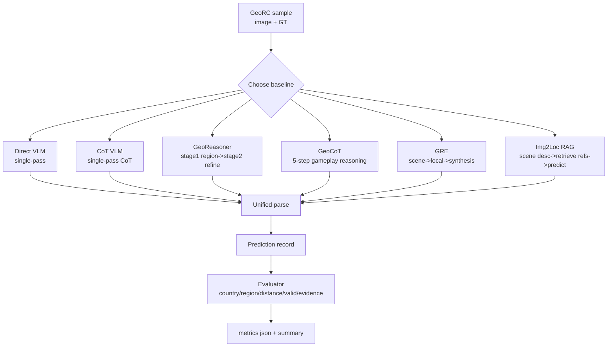

# GeoSkill Baseline 复现文档（论文来源 + 代码位置 + I/O）

本文档只讲 baseline。目标是：每个 baseline 看完就能实现，知道输入输出是什么、是否需要训练、如何评测。

## 1. Baseline 总览（论文来源与代码）

统一运行入口： [run_experiment.py](../scripts/run_experiment.py#L176)

方法注册表： [all_methods](../scripts/run_experiment.py#L233)

| 方法名 | 论文/思想来源 | 代码函数 | 核心范式 |
|---|---|---|---|
| direct_vlm | 零样本直接预测 | [direct_vlm_predict](../src/baselines.py#L147) | single-pass |
| cot_vlm | CoT prompting (Wei et al., 2022) | [cot_vlm_predict](../src/baselines.py#L159) | single-pass CoT |
| georeasoner | GeoReasoner (Li et al., 2024) | [georeasoner_predict](../src/baselines.py#L227) | two-stage |
| geocot | GeoCoT (2025) | [geocot_predict](../src/baselines.py#L268) | five-step gameplay reasoning |
| gre_multistage | GRE Suite (2025) | [gre_multistage_predict](../src/baselines.py#L296) | three-stage progressive reasoning |
| img2loc_rag | Img2Loc (Zhang et al., 2024) | [img2loc_rag_predict](../src/baselines.py#L803) | RAG |

注：Skill-Conditioned 系列是“主方法”而非 baseline，已单列在 [main_method_pipeline.md](./main_method_pipeline.md)。

## 2. 统一输入输出协议（所有 baseline 共用）

### 2.1 输入

每个 baseline 实际接收单图输入：

- `image_path`（来自 [make_sample](../scripts/run_experiment.py#L94)）

运行时记录还带 GT：

- `ground_truth_country`
- `ground_truth_lat`, `ground_truth_lng`
- `expert_chain`

### 2.2 输出

每个 baseline 最终返回统一结构（经 [ _parse_json_prediction ](../src/baselines.py#L30) 规范化）：

```json
{
  "predicted_country": "th",
  "predicted_region": "asia",
  "predicted_lat": 15.87,
  "predicted_lng": 100.99,
  "reasoning_text": "...",
  "evidence_spans": ["..."],
  "confidence": 0.75
}
```

如果方法内部有中间信息，会附加字段：

- `georeasoner`: `stage1_raw`, `stage1_parsed`
- `gre_multistage`: `scene_analysis`, `local_analysis`
- `img2loc_rag`: `scene_description`, `retrieved_refs`

## 3. 各 baseline 详细 pipeline（数据处理 -> 输入 -> 中间 -> 输出）

## 3.1 Direct VLM

函数： [direct_vlm_predict](../src/baselines.py#L147)

执行链：

1. 输入：`image_path`
2. 单次 VLM 调用（geolocation system prompt + JSON schema）
3. 解析输出为标准字段

优点：成本最低；缺点：容易被单次误判锚定。

## 3.2 CoT VLM

函数： [cot_vlm_predict](../src/baselines.py#L159)

执行链：

1. 输入：`image_path`
2. 单次 VLM，但 prompt 强制 6 类证据按顺序推理
3. 解析输出

与 direct 区别：只改 prompt，不改架构。

## 3.3 GeoReasoner（两阶段）

函数： [georeasoner_predict](../src/baselines.py#L227)

执行链：

1. Stage 1（图像输入）
- 先判 region + top3 countries
- 输出 `stage1_parsed`

2. Stage 2（图像输入）
- 带上 stage1 结果做细粒度国家与坐标推理

3. 输出解析

I/O 示例（中间）：

```json
{
  "stage1_parsed": {
    "region": "asia",
    "top3_countries": ["th", "my", "id"]
  }
}
```

## 3.4 GeoCoT（五步游戏化推理）

函数： [geocot_predict](../src/baselines.py#L268)

执行链：

1. 输入：`image_path`
2. 一次调用，但要求按 5 步推理：
- hemisphere/climate
- continent narrowing
- country identification
- region within country
- coordinate estimation
3. 输出解析

## 3.5 GRE Multi-stage（三阶段渐进）

函数： [gre_multistage_predict](../src/baselines.py#L296)

执行链：

1. Scene pass（图像）
- 输出全局场景 JSON（气候、发展程度、候选区域）

2. Local pass（图像）
- 输出局部细节 JSON（电线杆、道路标记、标识、车辆、建筑）

3. Synthesis pass（图像）
- 把 scene/local 摘要融合，给最终国家+坐标

中间 I/O 示例：

```json
{
  "scene_type": "rural",
  "climate": "tropical dry",
  "candidate_regions": ["asia", "africa"]
}
```

```json
{
  "pole_type": "concrete",
  "road_markings": "single yellow center line",
  "script_type": "latin"
}
```

## 3.6 Img2Loc RAG

函数： [img2loc_rag_predict](../src/baselines.py#L803)

执行链：

1. Scene description（图像）
2. 在技能库做检索（top_k=8，alpha=0.6）
3. 将 references + 图像一起输入 VLM
4. 输出解析并附加 `retrieved_refs`

中间 I/O 示例：

```json
{
  "retrieved_refs": [
    {
      "skill_text": "...",
      "region_hint": "asia",
      "score": 0.84
    }
  ]
}
```

## 4. Ablation baseline（附）

如果你也想复现论文里的消融基线：

- 入口： [run_ablation.py main](../scripts/run_ablation.py#L304)
- 方法映射： [all_methods in run_ablation](../scripts/run_ablation.py#L379)
- 关键函数：
- [no_skill_predict](../scripts/run_ablation.py#L131)
- [random_skill_predict](../scripts/run_ablation.py#L148)
- [shuffled_order_predict](../scripts/run_ablation.py#L187)
- [filtered_skill_predict](../scripts/run_ablation.py#L221)

真实 ablation 汇总文件： [summary_metrics.json](../experiments/ablation/summary_metrics.json)

## 5. 数据集、benchmark、评估指标、训练需求

### 5.1 数据集与 benchmark

- 数据集：GeoRC
- 配置： [full.yaml](../configs/full.yaml)
- 评测对象：默认 100 个 game 的 round 1

### 5.2 指标来源

统一评测代码： [evaluate_predictions](../src/evaluator.py#L81)

指标：

1. country_accuracy
2. continent_accuracy
3. distance_error_km_median + distance_error_km_mean_valid_only + distance_error_km_mean_penalized
4. Acc@1km / Acc@25km / Acc@150km / Acc@750km / Acc@2500km
5. valid_coordinate_rate
6. heuristic_hallucination_rate
7. expert_chain_token_f1

关键实现规则：无效坐标罚 20037km（非忽略）。

### 5.3 是否需要训练

baseline 全部不需要训练。

- 都是推理时 prompt 设计和流程编排
- 不更新 VLM 参数
- 仅使用预训练 embedding 模型做检索（如果用到 RAG）

## 6. 一键复现实验（baseline）

只跑 baseline（不跑 skill-conditioned 系列）：

```bash
python scripts/run_experiment.py --config configs/full.yaml --methods direct_vlm cot_vlm georeasoner geocot gre_multistage img2loc_rag
```

## 7. Baseline 总流程图（Mermaid）



## 8. 论文引用（baseline 对应）

可在论文源码中看到这些 baseline 引用与描述：

- [Baselines section](../paper/neurips_2026.tex#L205)
- [GeoReasoner citation](../paper/neurips_2026.tex#L468)
- [GRE citation](../paper/neurips_2026.tex#L473)
- [GeoCoT citation](../paper/neurips_2026.tex#L478)
- [Img2Loc citation](../paper/neurips_2026.tex#L483)
- [GeoRC benchmark citation](../paper/neurips_2026.tex#L498)
